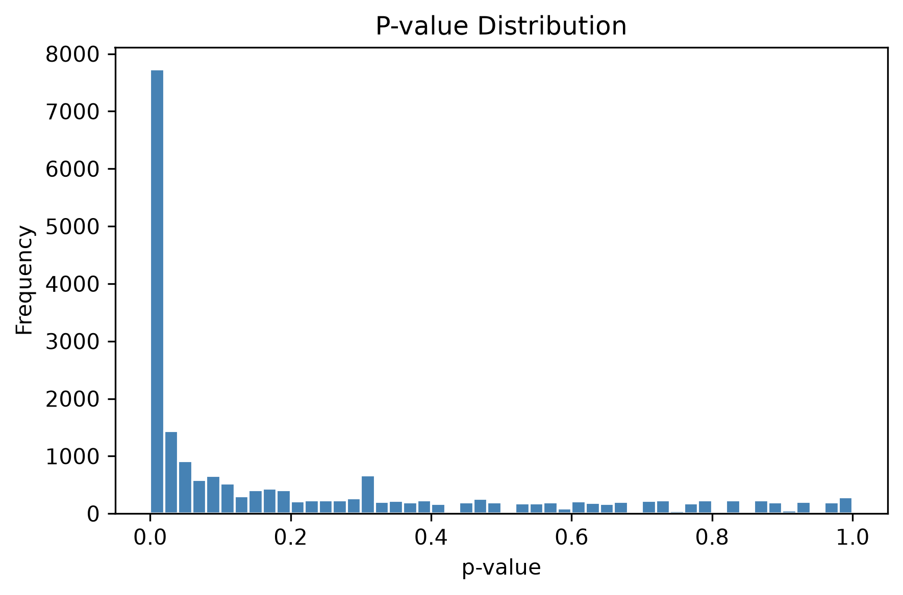
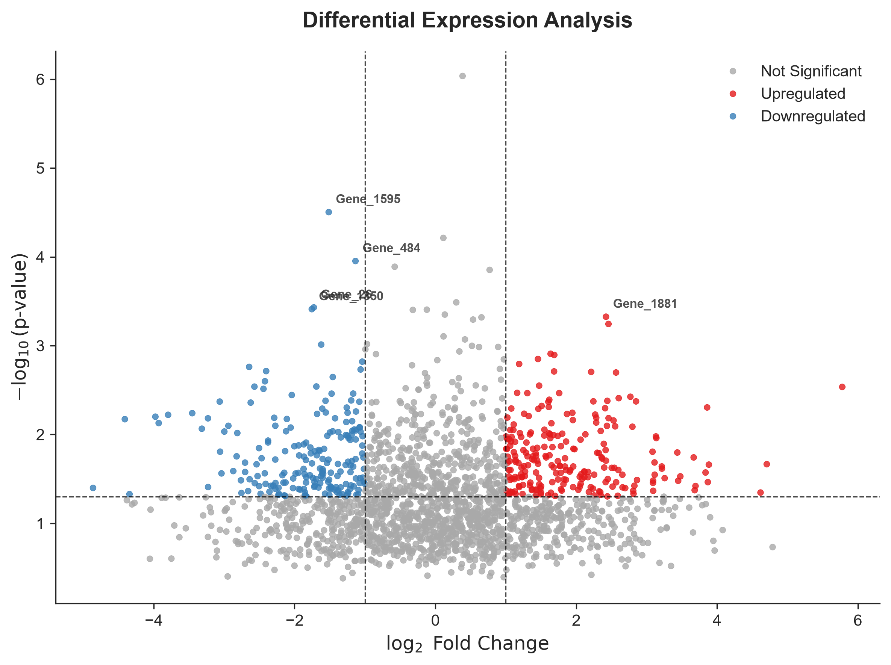
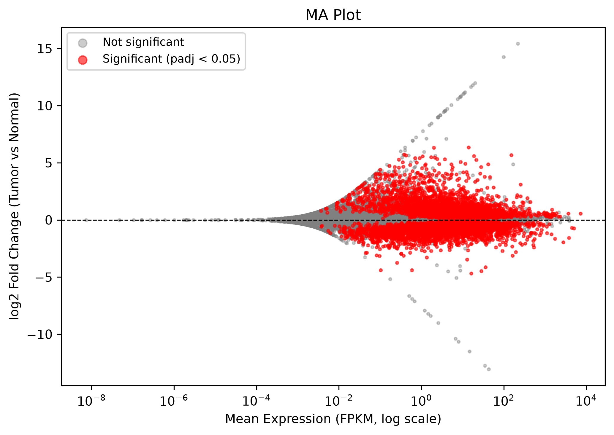
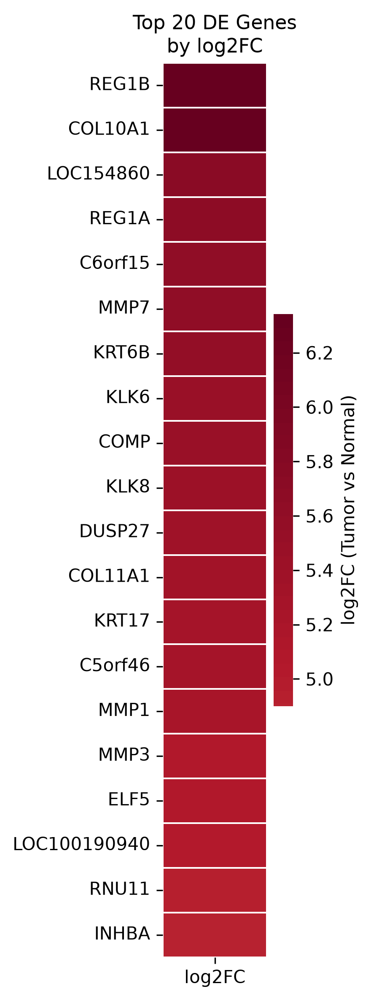

**Colorectal Cancer RNA-seq Analysis**

**Overview**
This project performs a differential gene expression analysis on RNA-seq data 
from colorectal cancer (tumor) vs. normal tissue samples, using the publicly 
available **GSE50760** dataset. The analysis identifies genes that are 
significantly up- or down-regulated in tumor tissue and visualizes the results 
through standard RNA-seq diagnostic and summary plots.

## Dataset
- **Source:** GEO accession [GSE50760](https://www.ncbi.nlm.nih.gov/geo/query/acc.cgi?acc=GSE50760)
- **Samples:** Paired tumor and normal colorectal tissue samples (FPKM-normalized expression)

Workflow & Results

 1. Quality Control — P-value Distribution
Checks that the differential expression test statistics behaved as expected 
(spike near zero = real signal, flat tail = well-calibrated null distribution).

2. Differential Expression — Volcano Plot
Log2 fold change vs. statistical significance, highlighting the most notable 
differentially expressed genes.

3. Differential Expression — MA Plot
Mean expression vs. log2 fold change, showing how variance narrows at higher 
expression levels and where significant genes fall across the expression range.

4. Top Differentially Expressed Genes — Heatmap
Top genes ranked by log2 fold change between tumor and normal tissue.

## Key Files
- `differential_expression_results.csv` — DE results table (gene, mean FPKM per group, p-value, padj, significance)
- `GSE50760_tumor_normal_FPKM.csv` — per-sample FPKM expression matrix
- `MA_plot.py`, `heatmap.py`, `diif_epression.py`, etc. — analysis and plotting scripts
- `*.png` — output figures

## Biological Interpretation

The top differentially expressed genes reflect three themes typical of 
colorectal cancer. **ECM remodeling genes** (COL10A1, COL11A1, COMP, MMP1, 
MMP3, MMP7) reflect tumor invasion and stromal remodeling. **Epithelial 
genes** (KRT6B, KRT17, ELF5) indicate altered differentiation programs. 
**REG1A/REG1B** and **INHBA** are established colorectal cancer progression 
markers. A few genes (C5orf46, C6orf15, LOC154860, LOC100190940, RNU11) are 
poorly characterized or non-coding, with no established colorectal cancer 
role. Overall, the pattern points to active tissue remodeling and disrupted 
epithelial identity — hallmarks of colorectal tumorigenesis.

Tools Used
- Python (pandas, numpy, matplotlib, seaborn, scikit-learn)

Summary
A well-behaved p-value distribution supports robust differential expression 
calls. Multiple genes show strong, significant fold changes between tumor and 
normal tissue, visualized via volcano, MA, and heatmap plots.
